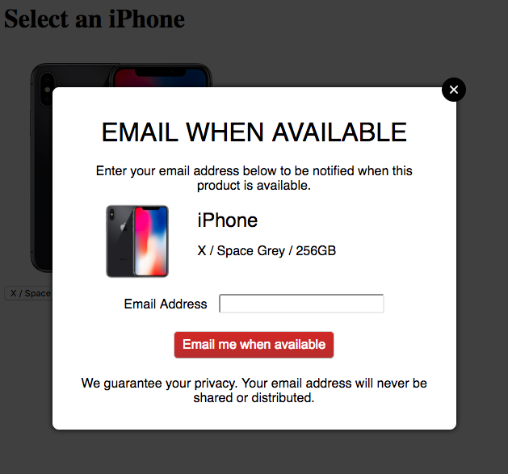

# Stock Notification Frontend

This frontend application is an example stock notification widget that allows customers to register for stock notifications. It can be modified and integrated with your existing online storefront.

The example registration form in our [demo.html](src/demo.html) file:

# Requirements

This frontend requires the Stock Notifications Database [REST API](../RestApi) to be running.

# Installation Notes

1. Download this repository
2. Download dependencies ([jQuery](https://jquery.com/) and [jQuery Modal](https://jquerymodal.com)). Either:
  * Install [npm](https://www.npmjs.com/) and run `npm install` to automatically download the dependencies, or
  * Download the packages manually from their websites and update `demo.html` with the path to the assets
3. Update `API_URL` in `stock-notification-api.js` with the full url of the Stock Notifications Database REST API endpoint
4. Optionally update `#product-selector option values` in `demo.html` with actual product variant IDs of your product variants that are currently in stock, so that when you run the [Notification Service](../NotificationService), it will detect the back-in-stock products and send email notifications. (This will also allow you to verify everything has been configured propertly)

Now just open `demo.html` in your browser and give it a run!

# Integration with Your Online Store

In order to integrate this form with your online store, you will need to:

1. Upload dependencies to your websites
2. Update the code on your product page to include `<script>` and `<link>` tags that reference the dependencies
3. Copy the entire `#stock-notification-form` code from `demo.html` into your product Page and update:
  * `#stock-notification-image-container`'s `` attribute with the URL to the product/variant image
  * `#stock-notification-product-title` text with the product title
4. In `stock-notification-frontend.js`, update `INPUT_VARIANT_SELECTOR` with the ID of the select element that contains the title text of the variant and the variant ID. You will need to modify this logic if your product page isn't set up this way.
5. Implement logic on your product page to display a "Notify Me When Available" button for product variants that are out of stock, and open the form (e.g. using an `onclick="openStockNotificationForm()"` attribute).
