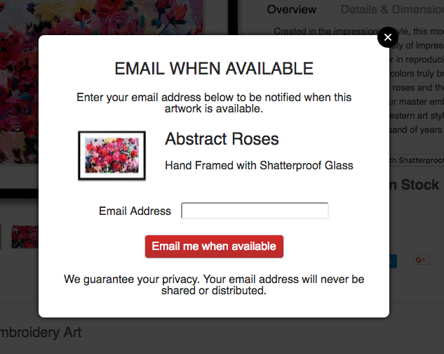
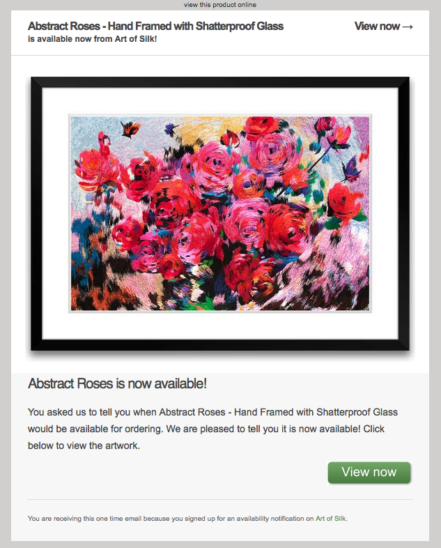

# Back in Stock

Make it easy for customers to sign up for and receive back in stock email alerts!

Sample email alert:

## Components

This application consists of three components:

1. [Frontend](FrontEnd) - Widget that allows a customer to request a back in stock notification on your website.
2. [Notification Service](NotificationService) - Emails notifications to customers when products are back in stock.
3. [Database REST API](RestApi) - CRUD API that stores all notification data:
    * FrontEnd - Creates new notifications in this database
    * Notification Service - Reads and updates this database's notifications

## Prerequisites

1. Ecommerce website (for the Frontend)
2. API access to your ecommerce platform (for the Notification Service)
2. Virtual private server or better (for the Database REST API)

## Installing & Deploying

Refer to each component's README file for instructions:
* [Frontend `README.md`](FrontEnd/README.md)
* [Notification Service `README.md`](NotificationService/README.md)
* [Database REST API `README.md`](RestApi/README.md)

## Definition of "Product" and "Variant"

A "product" is defined to have one or more "variants", e.g. a ball (product) may be sold in different colors and sizes (variants). The words "variant" and "product variant" may be used interchangeably throughout the code and documentation. In the case of the [ProductVariant interface](Objects/src/main/java/com/chrisleung/notifications/objects/ProductVariant.java), the words refer to the combination of a variant's data with its respective product data into a single object. "Product" alone refers generally to a product and all of its variants.

## Author

Chris Leung - [chrislzm](https://github.com/chrislzm)
